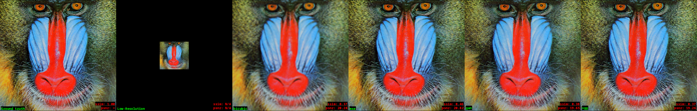
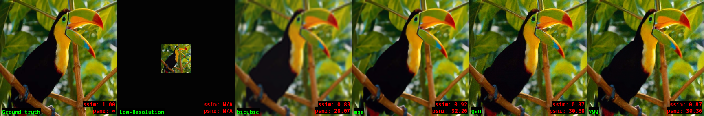
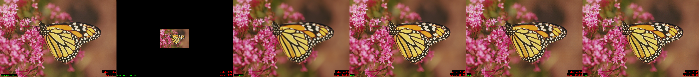
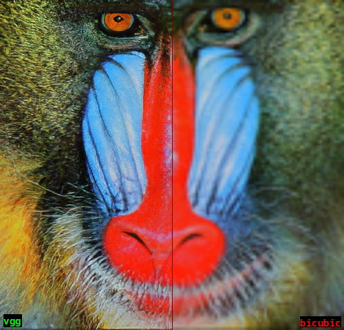

.. SimpleSR documentation master file, created by
   sphinx-quickstart on Sun May  3 16:22:16 2020.
   You can adapt this file completely to your liking, but it should at least
   contain the root `toctree` directive.

.. |br| raw:: html

   

:github_url: https://github.com/bw0248/SimpleSR

Welcome to SimpleSR's documentation!
====================================

.. include:: src/about.rst

.. toctree::
   :maxdepth: 2
   :caption: Getting started:

   src/start/installation.rst
   src/start/usage.rst
   src/start/examples.rst

.. toctree::
   :maxdepth: 2
   :caption: Results Gallery:

   src/results/results.rst

.. toctree::
   :maxdepth: 2
   :caption: Module Reference:

   src/modules/pipeline
   src/modules/models
   src/modules/training
   src/modules/eval
   src/modules/utils/utils

.. Indices and tables
.. ==================
.. 
.. * :ref:`genindex`
.. * :ref:`modindex`
.. * :ref:`search`

