Evaluation examples
=====================

Images are 4x downsampled first, then 4x upsampled again.
Produces visually less pleasing results but allows to calculate metrics.

Set5/Set14
-----------

.. image:: ../../_static/gallery/thesis/0.png
    :target: ../../_static/gallery/thesis/0.png

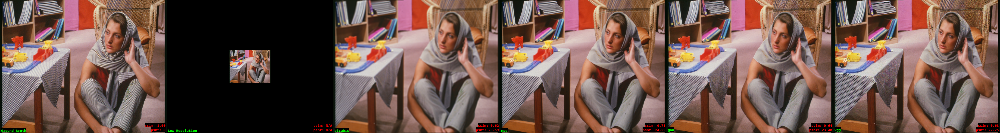

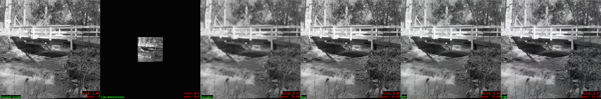

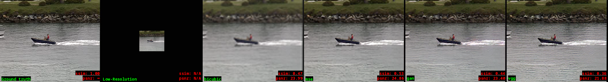

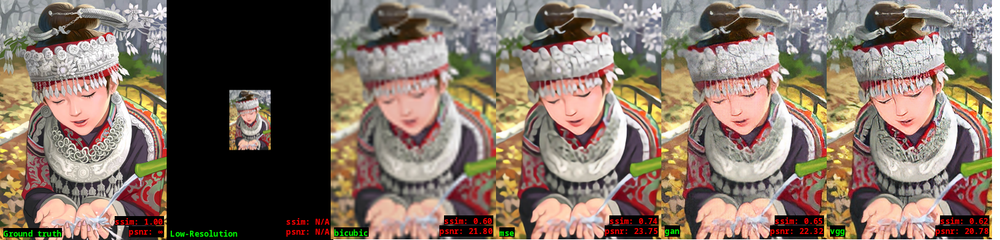

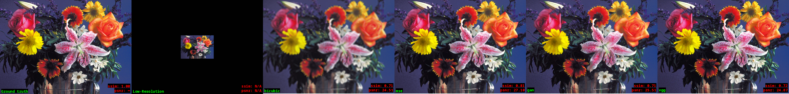

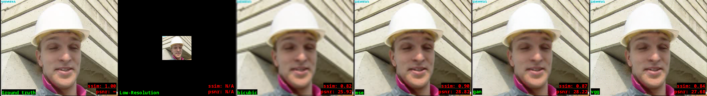

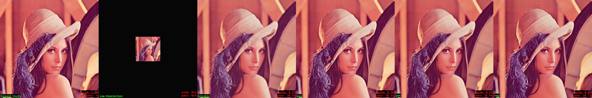

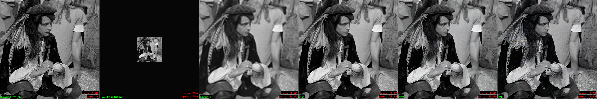

.. image:: ../../_static/gallery/thesis/10.png
    :target: ../../_static/gallery/thesis/10.png

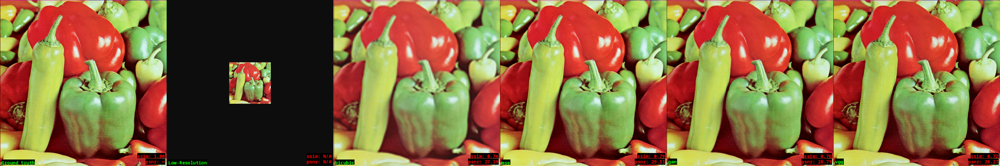

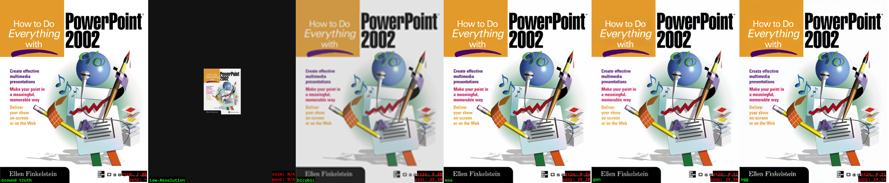

.. image:: ../../_static/gallery/thesis/13.png
    :target: ../../_static/gallery/thesis/13.png

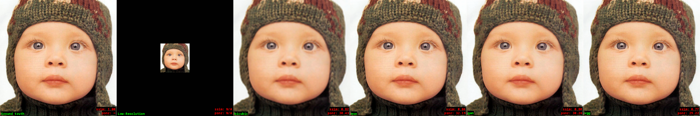

.. image:: ../../_static/gallery/thesis/15.png
    :target: ../../_static/gallery/thesis/15.png

.. image:: ../../_static/gallery/thesis/16.png
    :target: ../../_static/gallery/thesis/16.png

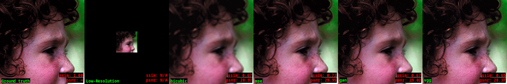

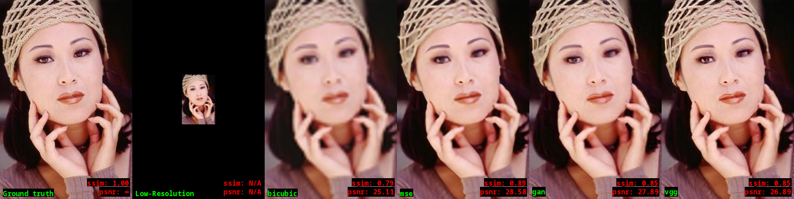

Zooms
------

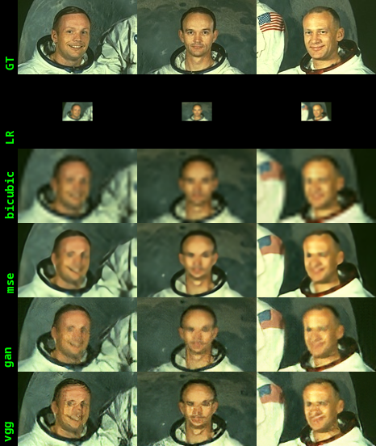

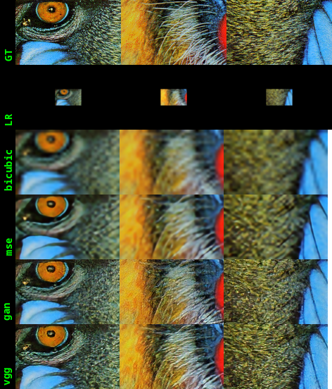

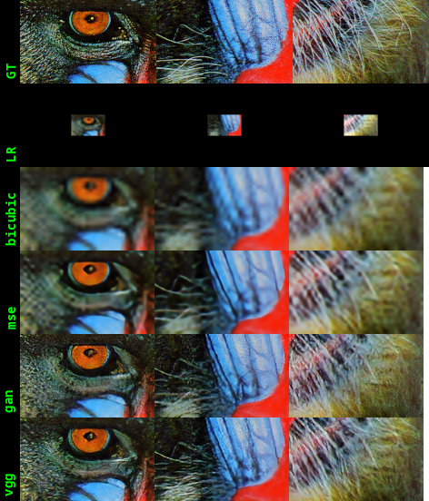

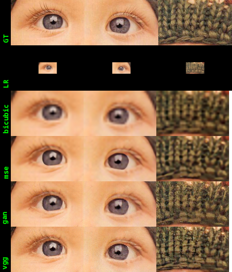

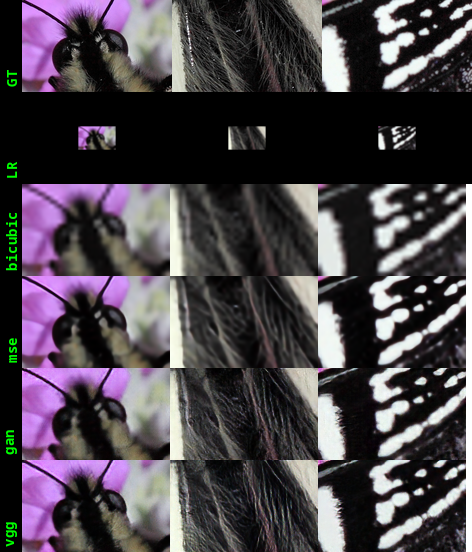

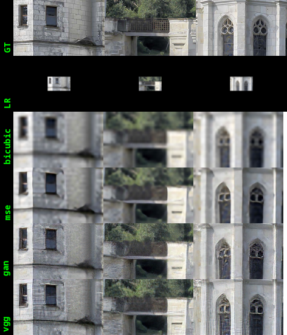

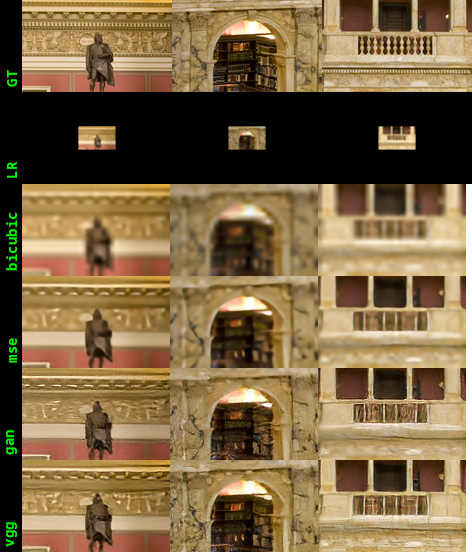

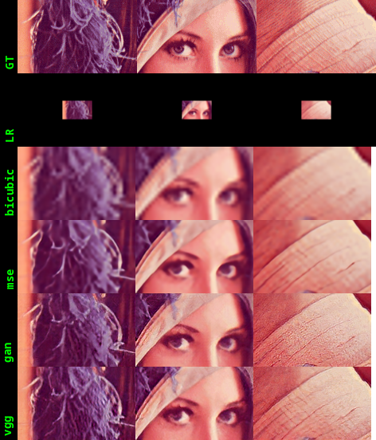

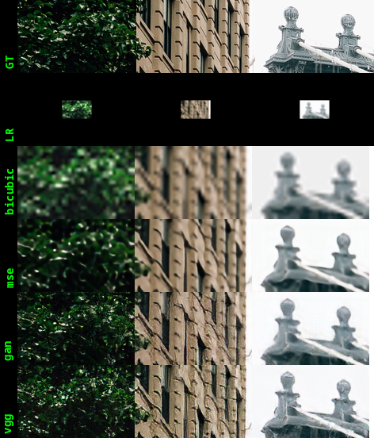

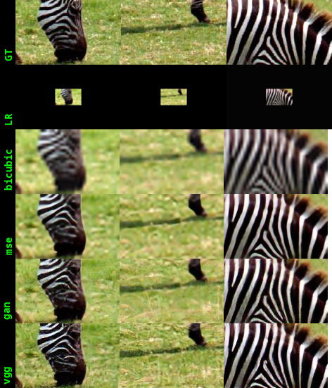
