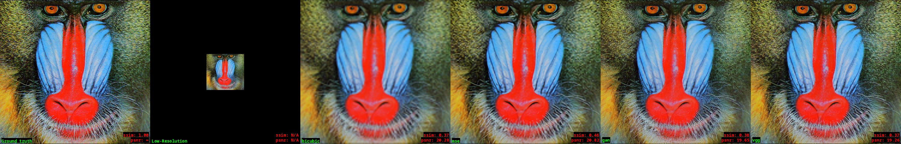
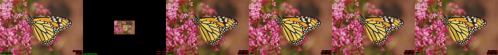
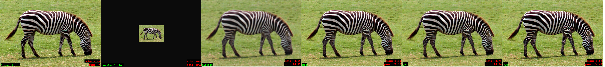
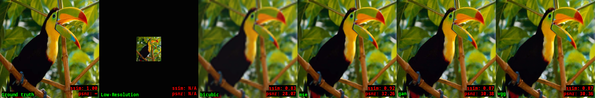
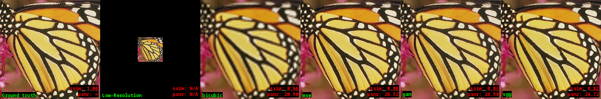

Evaluation examples
=====================

Images are 4x downsampled first, then 4x upsampled again.
Produces visually less pleasing results but allows to calculate metrics.

Set5/Set14
-----------

Zooms
------

